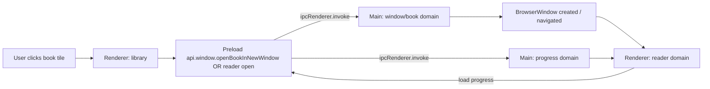

# MAP_LIBRARY_FLOW — Comics Library (click → scan → tiles → open reader → progress)

This map explains the *comics* side end-to-end. It’s written to answer:  
“Where does this UI action go, which process owns it, and where does it persist?”

---

## Flow A — Add a root/series folder → scan → tiles update

```mermaid
flowchart LR
  U[User clicks: Add Folder] --> R[Renderer: app/src/domains/library/*]
  R --> P[Preload: app/preload/index.js (api.library.*)]
  P -->|ipcRenderer.invoke| M[Main: app/main/domains/library/*]
  M --> W[Worker wrapper: app/library_scan_worker.js]
  W --> WI[Worker impl: app/workers/library_scan_worker_impl.js]
  WI --> S[State store: app/main/domains/library/index.js + app/main/lib/storage.js (persistence)]
  S -->|EVENT.LIBRARY_UPDATED| P
  P -->|ipcRenderer.on| R
  R --> UI[Library tiles refresh]
```

**Where to look:**
- Renderer library UI: `app/src/domains/library/` (search `FIND_THIS:` and `EDIT_ZONE:` markers inside files)
- Preload bridge: `app/preload/index.js` → `api.library.*`
- IPC channel names: `app/shared/ipc.js` (`CHANNEL.LIBRARY_*`, `EVENT.LIBRARY_*`)
- Main handlers: `app/main/domains/library/index.js`
- Worker wrapper: `app/library_scan_worker.js` (thin)
- Worker implementation: `app/workers/library_scan_worker_impl.js`
- Worker shared helpers: `app/workers/shared/*`

**Persistence:**
- Library state is owned by **Main** (never Renderer).
- The scan writes its results into the main-process library store (see `app/main/domains/library/`).

---

## Flow B — Click a book tile → open reader → resume progress



**Where to look:**
- Tile click + selection: `app/src/domains/library/*`
- Window orchestration: `app/main/domains/window/*`
- Reader UI: `app/src/domains/reader/*`
- Progress store: `app/main/domains/progress/*`

---

## “Don’t get lost” rules

- If you change **what gets scanned**, you’re in **Workers** → update `docs/04_LIBRARY_PIPELINE.md` + this map.
- If you change **what the UI shows**, you’re in **Renderer** → don’t move persistence there.
- If you change **IPC**, you must update `app/shared/ipc.js` first (single source of truth) and then update docs.

---

## Related docs

- `docs/04_LIBRARY_PIPELINE.md`
- `docs/03_INTER_PROCESS_COMMUNICATION.md`
- `docs/maps/MAP_PERSISTENCE_FLOW.md`
