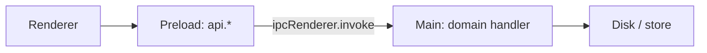

# MAP_PERSISTENCE_FLOW — What gets stored where (single source of truth)

This map is the “where is my data?” answer key.

---

## Core principle

- **Renderer** owns UI state and ephemeral interaction.
- **Main** owns persistent state and disk writes.
- **Workers** compute scan results; they do not own persistence as “truth”.

---

## Persistence inventory

### Comics library data
- Owned by: Main
- Updated by: library scan worker
- Where: `app/main/domains/library/*`

### Video library data
- Owned by: Main
- Updated by: video scan worker
- Where: `app/main/domains/video/*`

### Comic reading progress
- Owned by: Main
- Where: `app/main/domains/progress/*`

### Video progress
- Owned by: Main
- Where: `app/main/domains/videoProgress/*`

### Video settings and UI preferences
- Owned by: Main
- Where: `app/main/domains/videoSettings/*` and `app/main/domains/videoUi/*`

---

## The write path (Renderer → Preload → Main)

IPC channel names are declared in one place:
- `app/shared/ipc.js`

---

## Editing rules

- Never introduce new persistence by writing files directly from Renderer.
- If you add a new persisted field:
  1) update this map
  2) update the domain store
  3) update the IPC contract
  4) update any affected reminding docs

---

## Related docs

- `docs/07_STATE_AND_PERSISTENCE.md`
- `docs/03_INTER_PROCESS_COMMUNICATION.md`
