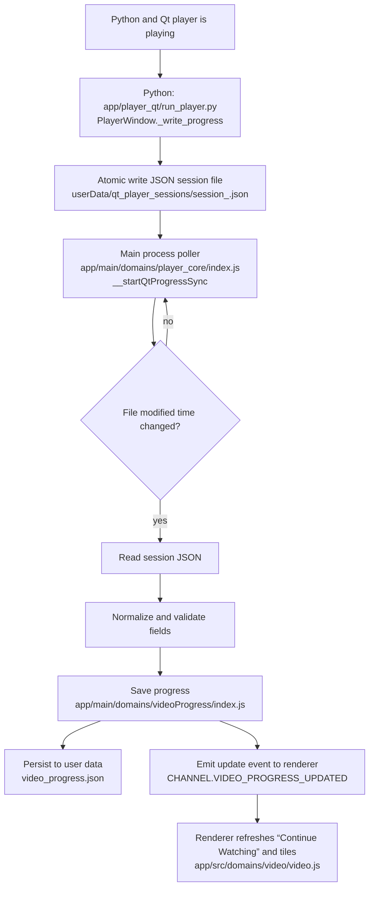

# Map: progress sync from Python player to the library

This map shows how “Continue Watching” and resume points update while the video is still playing.

## Session JSON schema (written by Python)

`session_<sessionId>.json` fields (common keys):

- `videoId`: string
- `showId`: string
- `sessionId`: string
- `position`: number (seconds)
- `duration`: number (seconds)
- `maxPosition`: number (seconds)
- `watchedTime`: number (seconds)
- `finished`: boolean
- `timestamp`: number (unix seconds)
- `phase`: string (examples: periodic, close, eof)

Track preference carry fields (best-effort):
- `aid`: audio track identifier
- `sid`: subtitle track identifier
- `subVisibility`: boolean
