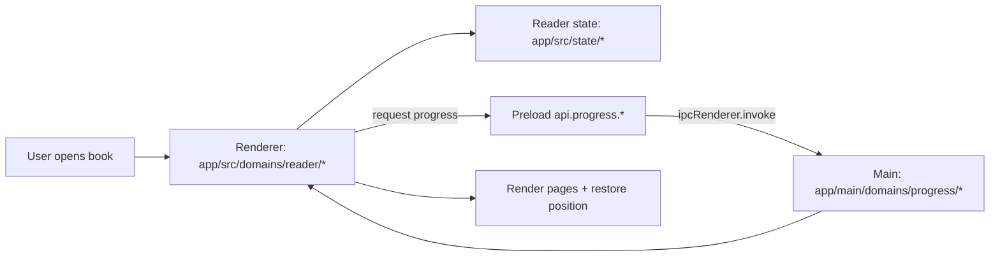

# MAP_READER_FLOW — Comic Reader (open → state → overlays → progress save)

This map is the reader-side trace. It answers:  
“Where does reading position live, and when does it get saved?”

---

## Flow A — Open a volume/chapter



**Where to look:**
- Reader domain: `app/src/domains/reader/`
- Reader state utilities: `app/src/state/`
- Main progress handling: `app/main/domains/progress/`

---

## Flow B — Progress saving (during reading + on exit)

```mermaid
flowchart LR
  RR[Reader renderer] -->|poll / on-close| P[Preload api.progress.*]
  P -->|ipcRenderer.invoke| M[Main: progress domain]
  M --> DB[Progress persistence (main-owned)]
  DB -->|optional state refresh| RR
```

**Key idea:**  
Progress is stored in **Main** (single source of truth). Renderer requests + submits updates.

---

## Overlays and navigation

- UI overlays live in the reader domain (Renderer): `app/src/domains/reader/*`
- Any setting that must persist beyond a session should go through Preload → Main.

---

## Related docs

- `docs/07_STATE_AND_PERSISTENCE.md`
- `docs/03_INTER_PROCESS_COMMUNICATION.md`
- `docs/maps/MAP_PERSISTENCE_FLOW.md`
