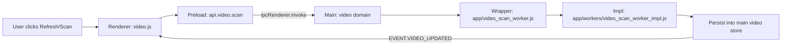
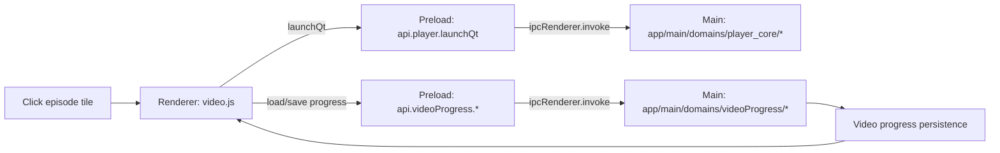

# MAP_VIDEO_FLOW — Videos (library navigation → play → progress → resume)

This is the videos trace map. It’s the one you use when:
- folders/shows/episodes aren’t loading
- back buttons or breadcrumbs don’t work
- progress saving/resuming is broken

---

## Flow A — Videos home (roots) → show view → episodes grid

```mermaid
flowchart LR
  U[User clicks Videos mode] --> R[Renderer: app/src/domains/video/video_utils.js (loaded first)
app/src/domains/video/video.js]
  R --> P[Preload: api.video.getState / getEpisodesForShow]
  P -->|ipcRenderer.invoke| M[Main: app/main/domains/video/*]
  M --> S[Video state store (main-owned)]
  S -->|return state| R
  M -->|EVENT.VIDEO_UPDATED| P
  P -->|ipcRenderer.on| R
  R --> UI[Render shows + episodes]
```

**Where to look:**
- Renderer videos module: `app/src/domains/video/video_utils.js (loaded first)
app/src/domains/video/video.js` (search `AI_ANCHOR:`)
- Preload bridge: `app/preload/index.js` → `api.video.*`
- Main video domain: `app/main/domains/video/*`
- IPC names: `app/shared/ipc.js` (`VIDEO_*` + `VIDEO_UPDATED`)

---

## Flow B — Scan video folders (import)



**Worker helpers live here:**
- `app/workers/shared/*` (ignore/id/fs-safe)

---

## Flow C — Click episode → play → progress save/resume



**Where to look:**
- Renderer launch path: `app/src/domains/video/video.js` (search `AI_EXIT_PATH:` + `launchQt`)
- Main video progress: `app/main/domains/videoProgress/`
- Subtitle/audio preferences: `app/main/domains/videoSettings/` + `app/main/domains/videoUi/`

---

## Related docs

- `docs/05_VIDEO_PIPELINE.md`
- `docs/07_STATE_AND_PERSISTENCE.md`


